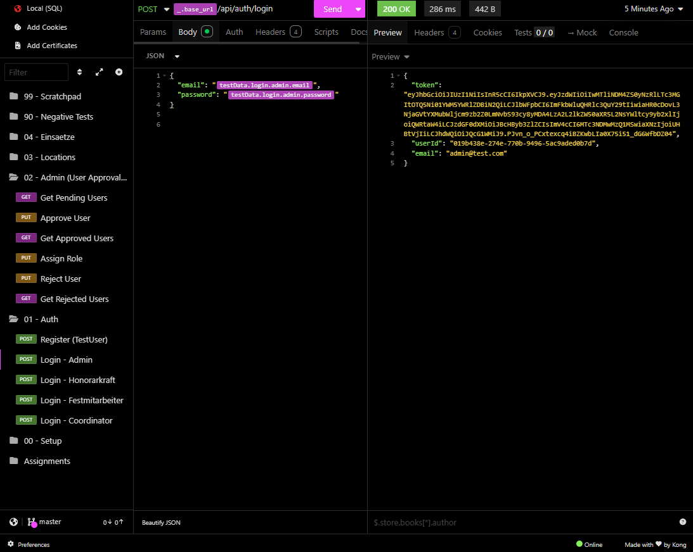
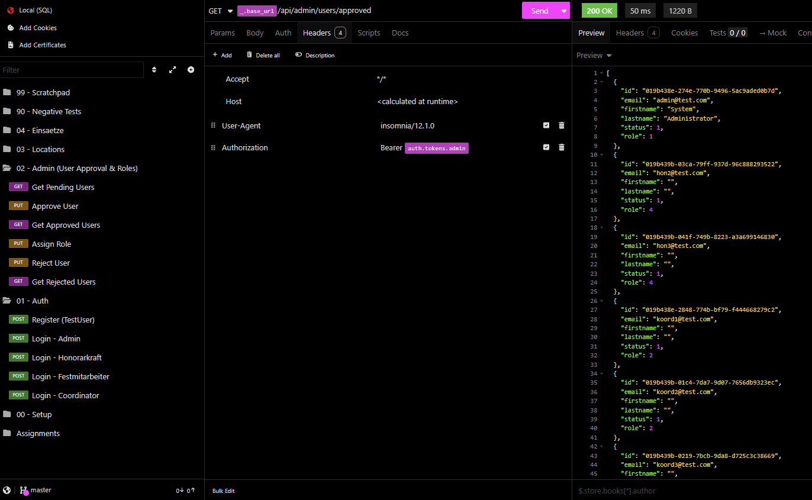
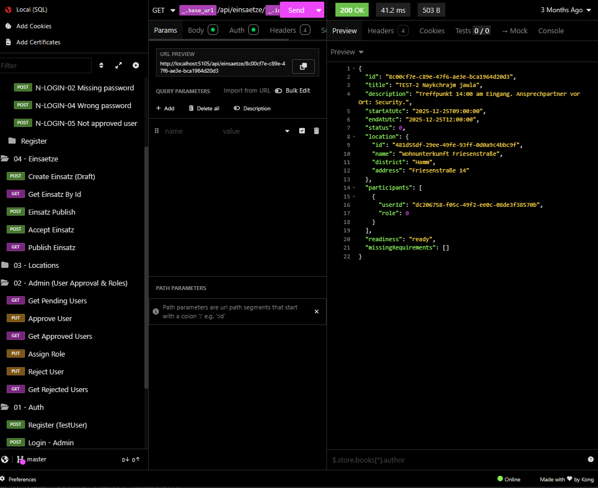
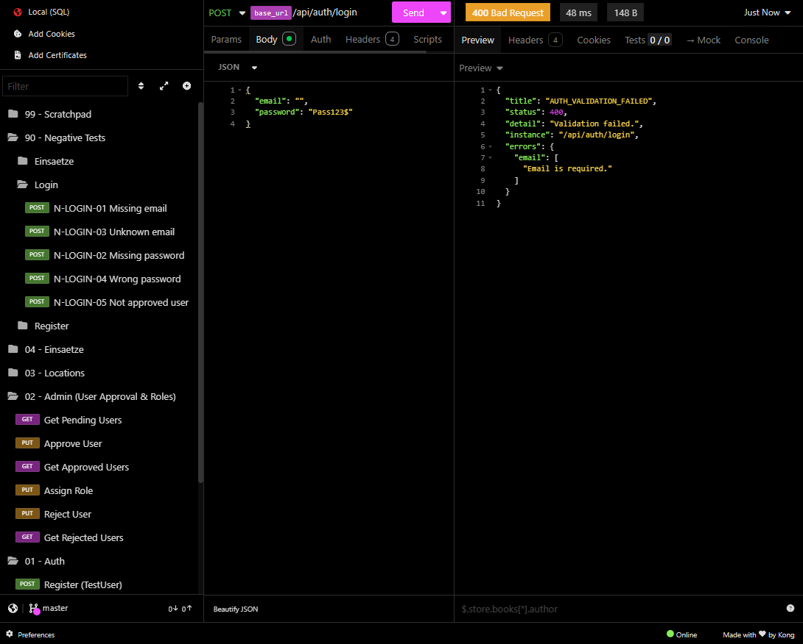
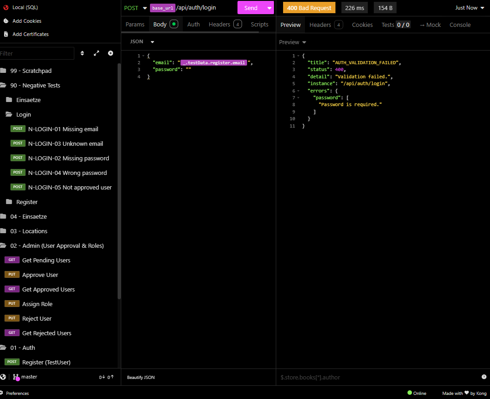
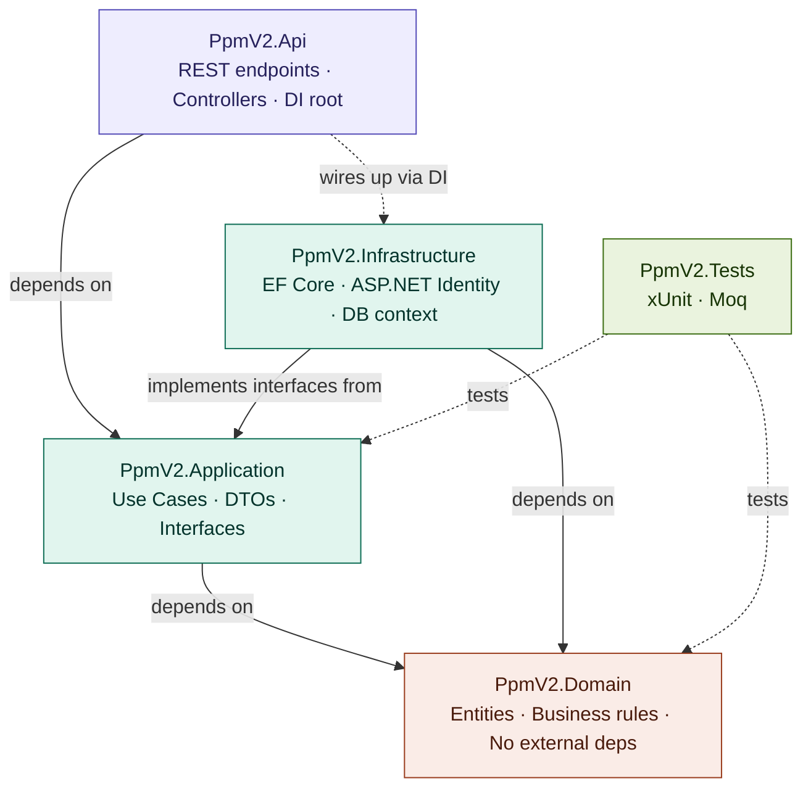
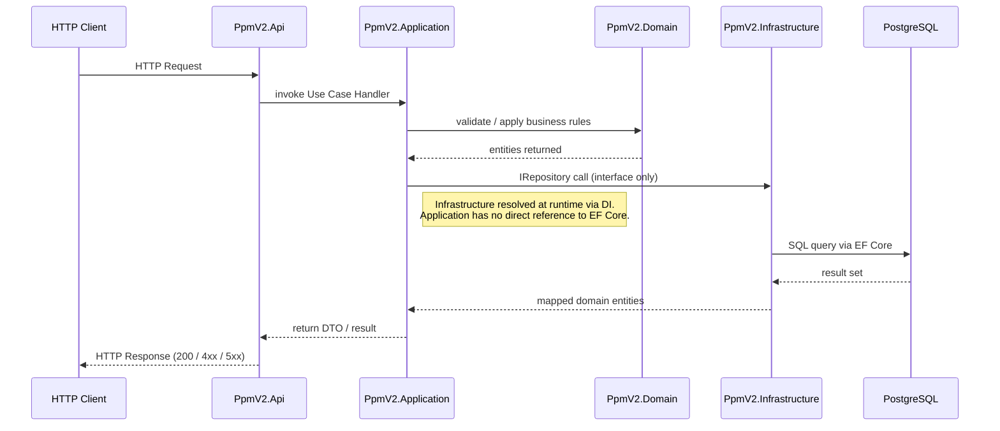

# PpmV2 — Schichtverwaltungs-Backend

[](https://dotnet.microsoft.com/)
[](https://docs.microsoft.com/aspnet/core/)
[](https://www.postgresql.org/)
[](https://www.docker.com/)
[](https://xunit.net/)

REST-API zur Verwaltung von Einsätzen, Standorten und rollenbasierter Benutzerverwaltung.
Entwickelt als vollständige Neuentwicklung des [Originals in Laravel](https://github.com/djzh23/apiproject) — migriert auf .NET 10 nach Clean-Architecture-Prinzipien.

> **Frontend:** [PpmV2-Next-Client](https://github.com/djzh23/PpmV2-Next-Client) — Next.js 16 + shadcn/ui

---

## Screenshots

**Authentifizierung — Login (POST /api/auth/login)**


**Admin — Genehmigte Benutzer abrufen (GET /api/admin/users/approved)**


**Einsatz — Einzelner Einsatz per ID (GET /api/einsaetze/:id)**


**Negative Tests — Validierungsfehler (400 Bad Request)**

| Fehlende E-Mail | Fehlendes Passwort |
|---|---|
|  |  |

---

## Architektur





> Vollständige Architekturdokumentation: [`src/docs/architecture.md`](src/docs/architecture.md)

---

## Funktionsumfang

| Bereich | Implementiert |
|---|---|
| Authentifizierung | Registrierung, Login, JWT-Token |
| Benutzergenehmigung | Admin genehmigt oder lehnt ausstehende Benutzer ab |
| Rollenverwaltung | Admin weist Rollen zu (Admin, Koordinator, Leader, Honorarkraft) |
| Einsätze | Erstellen, Veröffentlichen, Abrufen per ID — mit Standort- und Teilnehmerdaten |
| Standorte | CRUD für Einsatzstandorte |
| Validierung | Strukturierte `400 Bad Request`-Antworten mit feldbezogenen Fehlermeldungen |
| Negative Tests | Vollständige Negativtestsuite in Insomnia (fehlende Felder, falsches Passwort, nicht genehmigter Benutzer) |

---

## Projektstruktur

```
PpmV2/
├── src/
│   ├── PpmV2.Api/            # Controller, Middleware, Program.cs (DI-Root)
│   ├── PpmV2.Application/    # Use Cases, DTOs, IRepository-Schnittstellen
│   ├── PpmV2.Domain/         # Entitäten, Geschäftsregeln — keine ext. Abhängigkeiten
│   ├── PpmV2.Infrastructure/ # EF Core, ASP.NET Identity, Repository-Implementierungen
│   └── docs/
│       ├── architecture.md
│       ├── screenshots/      # Insomnia-API-Screenshots
│       └── diagrams/         # Architekturdiagramme
├── PpmV2.Tests/              # xUnit + Moq Unit-Tests
└── docker-compose.yml        # App + PostgreSQL
```

---

## Schnellstart

```bash
git clone https://github.com/djzh23/PpmV2.git
cd PpmV2
docker-compose up -d
# API:     http://localhost:5000
# Swagger: http://localhost:5000/swagger
```

**Lokale Entwicklung (ohne Docker für die App):**
```bash
# Nur die Datenbank als Container starten
docker-compose up -d db

# Migrationen anwenden
dotnet ef database update \
  --project src/PpmV2.Infrastructure \
  --startup-project src/PpmV2.Api

# API starten
dotnet run --project src/PpmV2.Api
```

**Tests ausführen:**
```bash
dotnet test
```

---

## API-Endpunkte

| Methode | Route | Beschreibung | Auth |
|---|---|---|---|
| `POST` | `/api/auth/register` | Neuen Benutzer registrieren | — |
| `POST` | `/api/auth/login` | Anmelden → JWT-Token | — |
| `GET` | `/api/admin/users/approved` | Genehmigte Benutzer auflisten | Admin |
| `GET` | `/api/admin/users/pending` | Ausstehende Benutzer auflisten | Admin |
| `PUT` | `/api/admin/users/:id/approve` | Benutzer genehmigen | Admin |
| `PUT` | `/api/admin/users/:id/role` | Rolle zuweisen | Admin |
| `PUT` | `/api/admin/users/:id/reject` | Benutzer ablehnen | Admin |
| `GET` | `/api/einsaetze/:id` | Einsatz per ID abrufen | Auth |
| `POST` | `/api/einsaetze` | Einsatz erstellen (Entwurf) | Koordinator |
| `POST` | `/api/einsaetze/:id/publish` | Einsatz veröffentlichen | Koordinator |
| `GET` | `/api/locations` | Standorte auflisten | Auth |

---

## Technologie-Stack

| Kategorie | Technologie |
|---|---|
| Laufzeit | .NET 10 |
| Framework | ASP.NET Core Web API |
| Authentifizierung | ASP.NET Core Identity + JWT |
| ORM | Entity Framework Core |
| Datenbank | PostgreSQL |
| Container | Docker + Docker Compose |
| Tests | xUnit + Moq |
| Architektur | Clean Architecture |

---

## Roadmap

- [x] Clean-Architecture-Schichtaufbau
- [x] ASP.NET Core Identity
- [x] Repository-Pattern
- [x] Docker Compose + PostgreSQL
- [x] xUnit + Moq Unit-Tests
- [x] Architekturdokumentation
- [x] JWT-Authentifizierung
- [x] Rollenbasierte Zugriffskontrolle (RBAC)
- [x] Strukturierte Validierungsfehler
- [ ] Globaler Fehler-Handler (Problem Details RFC 7807)
- [ ] GitHub Actions CI/CD-Pipeline
- [ ] Integrationstests

---

## Verwandte Projekte

| Repository | Beschreibung |
|---|---|
| [PpmV2-Next-Client](https://github.com/djzh23/PpmV2-Next-Client) | Next.js-16-Frontend für diese API |
| [apiproject](https://github.com/djzh23/apiproject) | Laravel-v1-Backend (ursprüngliche Version) |
| [frontendproject](https://github.com/djzh23/frontendproject) | .NET-MAUI-Mobile-Client |

---

*Zouhair Ijaad · [LinkedIn](https://www.linkedin.com/in/zouhair-ijaad/)*