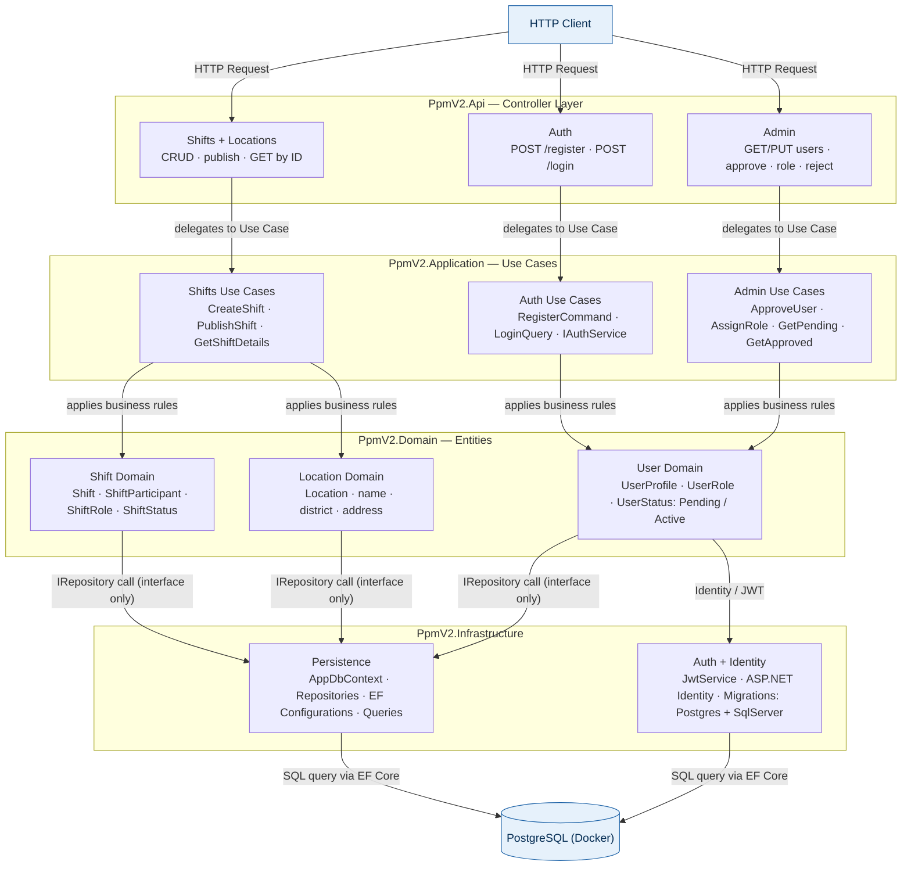
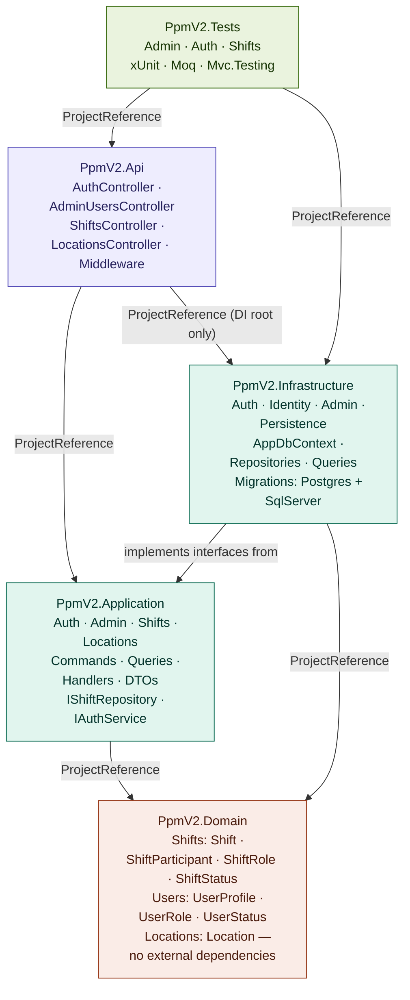
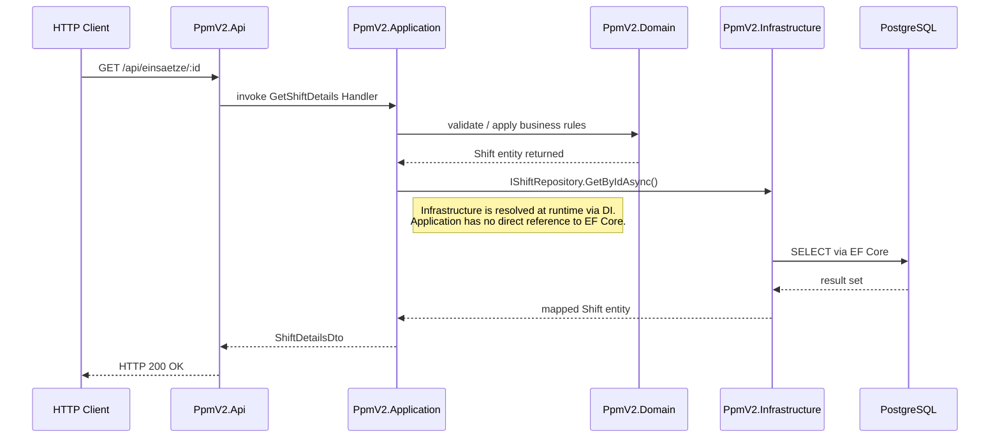

# Architekturüberblick — PpmV2

PpmV2 ist ein REST-Backend nach **Clean Architecture**. Geschäftsregeln und Datenbankzugriffe sind strikt getrennt. Ein HTTP-Request durchläuft immer dieselben vier Schichten von oben nach unten — und kehrt als Response zurück. Keine Schicht überspringt eine andere, und die innerste Schicht (Domain) kennt weder die Datenbank noch das Web-Framework.

---

## Feature-Übersicht und Datenfluss

Das folgende Diagramm zeigt, **welche Funktion in welcher Schicht liegt** und **wie ein Request von oben nach unten fließt**.

**Leseanleitung:**
- **Controller Layer (Api):** Nimmt HTTP-Requests entgegen und leitet sie weiter — enthält keine Geschäftslogik.
- **Use Cases (Application):** Orchestrieren den Ablauf. Sie kennen die Domain, aber nicht die Datenbank. Persistenz wird nur über Interfaces aufgerufen.
- **Entities (Domain):** Reine Fachlogik — `Shift`, `UserProfile`, `Location`. Kein EF Core, kein HTTP, keine externen Pakete.
- **Infrastructure:** Implementiert die Interfaces aus Application. Hier liegt EF Core, Identity und JWT — alles was mit externen Systemen kommuniziert.
- **`IRepository call (interface only)`:** Der Use Case kennt nur das Interface. Welche konkrete Klasse dahintersteckt, entscheidet der DI-Container in `Program.cs` zur Laufzeit — Application weiß davon nichts.

---

## Projektabhängigkeiten

Dieses Diagramm zeigt die **compile-time Abhängigkeiten** zwischen den .NET-Projekten — also welches Projekt welches andere referenziert. Die Pfeile zeigen immer **nach innen**: wer wen kennt.

**Erklärung der Pfeile:**
- **`ProjectReference`** — harte compile-time Abhängigkeit. Das Projekt kennt das andere direkt.
- **`ProjectReference (DI root only)`** — `Api` referenziert `Infrastructure` ausschließlich um dort die Interfaces an konkrete Implementierungen zu binden (`Program.cs`). Für Geschäftslogik wird Infrastructure nie direkt genutzt.
- **`implements interfaces from`** — `Infrastructure` kennt die Interfaces aus `Application` (z. B. `IShiftRepository`) und liefert die konkrete EF-Core-Implementierung. `Application` selbst weiß davon nichts.
- **`PpmV2.Tests` → `Api` + `Infrastructure`** — Tests referenzieren beide, um über den DI-Container alle Schichten im Testkontext erreichbar zu machen.

**Wichtige Regel:** `PpmV2.Domain` hat keine ausgehenden Pfeile — es kennt keine andere Schicht und hat keine externen NuGet-Pakete.

---

## Request Flow — Schritt für Schritt

Beispiel: Ein Benutzer ruft einen Einsatz per ID ab.

**Erklärung Schritt für Schritt:**
1. Der **Controller** empfängt den Request und ruft den zuständigen Handler auf — keine Logik im Controller selbst.
2. Der **Handler** (Application-Schicht) koordiniert den Ablauf: zuerst Domain-Validierung, dann Datenzugriff.
3. Die **Domain** prüft Geschäftsregeln und gibt Entitäten zurück.
4. Der Handler ruft `IShiftRepository.GetByIdAsync()` — nur das Interface, nicht EF Core direkt.
5. Der **DI-Container** hat beim Start `IShiftRepository` an `ShiftRepository` (EF Core) gebunden — das passiert in `Program.cs`.
6. **Infrastructure** führt die SQL-Abfrage aus und gibt gemappte Entitäten zurück.
7. Der Handler baut ein `ShiftDetailsDto` und gibt es an den Controller zurück.
8. Der **Controller** sendet die HTTP-Response.

---

## Zusammenfassung

| Schicht | Verantwortung | Externe NuGet-Pakete |
|---|---|---|
| `PpmV2.Domain` | Entitäten und Geschäftsregeln | keine |
| `PpmV2.Application` | Use Cases, Interfaces, DTOs | keine |
| `PpmV2.Infrastructure` | EF Core, Identity, JWT, Migrations | EF Core · Npgsql · Identity |
| `PpmV2.Api` | Controller, Middleware, DI-Root | JwtBearer · OpenApi |
| `PpmV2.Tests` | Unit- und Integrationstests | xUnit · Moq · Mvc.Testing |