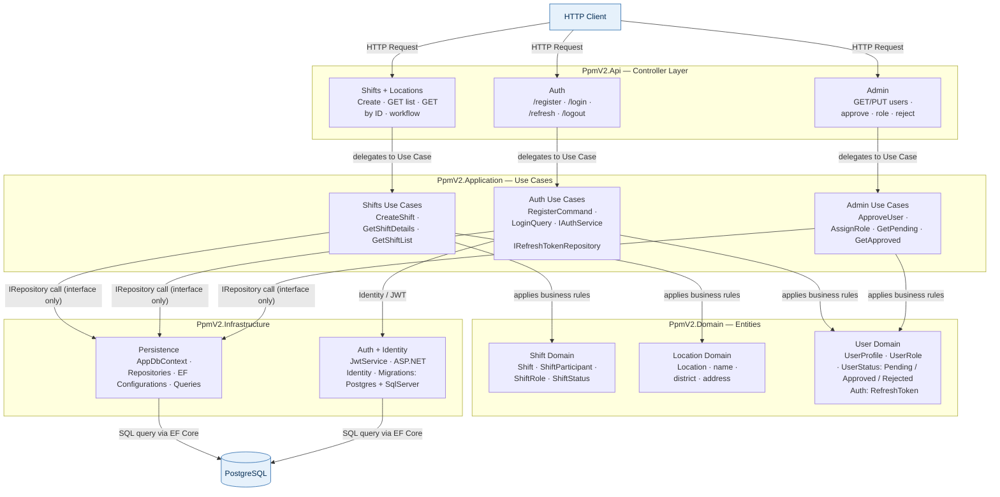
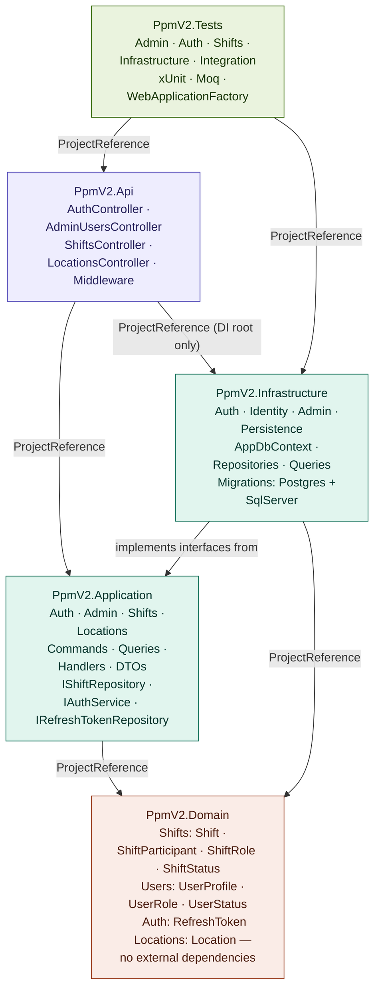
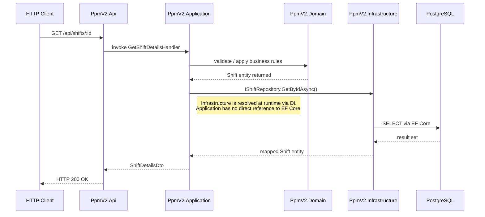

# Architecture — PpmV2

PpmV2 follows Clean Architecture across four projects. Business rules and data access are strictly separated. Every HTTP request flows through the same four layers top to bottom and returns as a response. No layer skips another, and the innermost layer (Domain) has zero knowledge of the database or web framework.

---

## Layer Overview and Request Flow

This diagram shows which responsibility belongs to which layer and how a request flows from top to bottom.

- **Controller Layer (Api):** Receives HTTP requests and delegates to handlers. No business logic here.
- **Use Cases (Application):** Orchestrate the flow. They know the Domain but not the database. Persistence is called through interfaces only.
- **Entities (Domain):** Pure business logic — `Shift`, `UserProfile`, `Location`, `RefreshToken`. No EF Core, no HTTP, no external packages.
- **Infrastructure:** Implements the interfaces from Application. EF Core, Identity, and JWT live here — everything that talks to external systems.
- **IRepository call (interface only):** The use case only knows the interface. Which concrete class is behind it is decided by the DI container in `Program.cs` at runtime — Application knows nothing about it.

---

## Project Dependencies

This diagram shows the compile-time dependencies between .NET projects — which project references which. Arrows always point inward: who knows whom.

- **`ProjectReference`:** Hard compile-time dependency. The project knows the other directly.
- **`ProjectReference (DI root only)`:** `Api` references `Infrastructure` exclusively to bind interfaces to concrete implementations in `Program.cs`. Infrastructure is never used directly for business logic.
- **`implements interfaces from`:** `Infrastructure` knows the interfaces from `Application` (e.g. `IShiftRepository`) and provides the concrete EF Core implementation. `Application` itself knows nothing about it.
- **`PpmV2.Tests` → `Api` + `Infrastructure`:** Tests reference both to reach all layers through the DI container in the test context.

`PpmV2.Domain` has no outgoing arrows — it knows no other layer and has no external NuGet packages.

---

## Request Flow — Step by Step

Example: a user fetches a shift by ID.

1. The **Controller** receives the request and calls the handler. No logic in the controller itself.
2. The **Handler** (Application layer) coordinates the flow: first domain validation, then data access.
3. The **Domain** checks business rules and returns entities.
4. The handler calls `IShiftRepository.GetByIdAsync()` — the interface only, not EF Core directly.
5. The **DI container** bound `IShiftRepository` to `ShiftRepository` (EF Core) on startup in `Program.cs`.
6. **Infrastructure** runs the SQL query and returns mapped entities.
7. The handler builds a `ShiftDetailsDto` and returns it to the controller.
8. The **Controller** sends the HTTP response.

---

## Layer Summary

| Layer | Responsibility | External NuGet packages |
|---|---|---|
| `PpmV2.Domain` | Entities and business rules | None |
| `PpmV2.Application` | Use cases, interfaces, DTOs | None |
| `PpmV2.Infrastructure` | EF Core, Identity, JWT, Migrations | EF Core, Npgsql, Identity |
| `PpmV2.Api` | Controllers, middleware, DI root | JwtBearer, OpenApi |
| `PpmV2.Tests` | Unit and integration tests | xUnit, Moq, WebApplicationFactory, real PostgreSQL |
