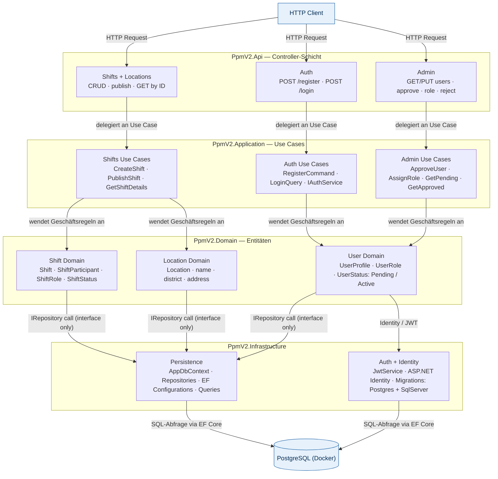
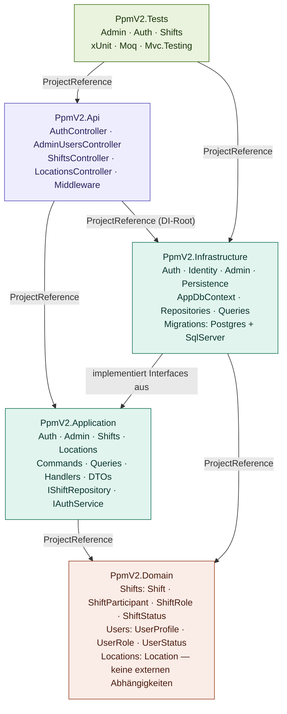

# Architekturüberblick — PpmV2

PpmV2 ist ein REST-Backend nach **Clean Architecture**. Das bedeutet: Geschäftsregeln und Datenbankzugriffe sind strikt getrennt. Ein HTTP-Request läuft immer denselben Weg — von oben nach unten durch vier Schichten — und kehrt als Response zurück. Keine Schicht springt dabei eine andere über, und die innerste Schicht (Domain) kennt weder die Datenbank noch das Web-Framework.

---

## Feature-Übersicht und Datenfluss

Das folgende Diagramm zeigt, **welche Funktion in welcher Schicht liegt** und **wie ein Request von oben nach unten fließt**.

**Leseanleitung:**
- **Controller-Schicht (Api):** Nimmt HTTP-Requests entgegen und leitet sie weiter — enthält keine Geschäftslogik.
- **Use Cases (Application):** Orchestrieren den Ablauf. Kennen die Domain, aber nicht die Datenbank. Greifen nur über Interfaces auf Persistenz zu.
- **Entitäten (Domain):** Reine Fachlogik — `Shift`, `UserProfile`, `Location`. Kein EF Core, kein HTTP, keine externen Pakete.
- **Infrastructure:** Implementiert die Interfaces aus Application. Hier liegt EF Core, Identity und JWT — alles was mit externen Systemen spricht.
- **Gestrichelte Pfeile (`IRepository call`):** Der Use Case ruft nur das Interface auf. Welche konkrete Klasse dahintersteckt, entscheidet der DI-Container in `Program.cs` zur Laufzeit.

---

## Projektabhängigkeiten

Dieses Diagramm zeigt die **compile-time Abhängigkeiten** zwischen den .NET-Projekten — also welches Projekt welches andere referenziert.

**Wichtige Regel:** Abhängigkeiten zeigen immer **nach innen** — `Api → Application → Domain`. Die Pfeilrichtung zeigt an, wer wen kennt. `Domain` kennt niemanden — deshalb hat es keine ausgehenden Pfeile.

`PpmV2.Infrastructure` zeigt einen Pfeil zu `PpmV2.Application` (`implementiert Interfaces aus`), weil Infrastructure die dort definierten Repository-Interfaces konkret umsetzt — aber Application weiß davon nichts.

---

## Request Flow — Schritt für Schritt

---

## Zusammenfassung

| Schicht | Verantwortung | Externe Pakete |
|---|---|---|
| `PpmV2.Domain` | Entitäten und Geschäftsregeln | keine |
| `PpmV2.Application` | Use Cases, Interfaces, DTOs | keine |
| `PpmV2.Infrastructure` | EF Core, Identity, JWT, Migrations | EF Core · Npgsql · Identity |
| `PpmV2.Api` | Controller, Middleware, DI-Root | JwtBearer · OpenApi |
| `PpmV2.Tests` | Unit- und Integrationstests | xUnit · Moq · Mvc.Testing |